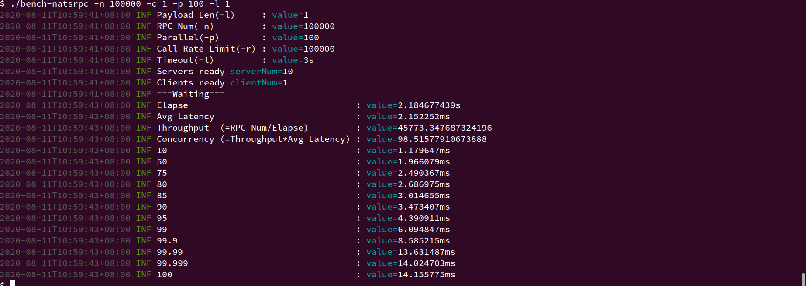
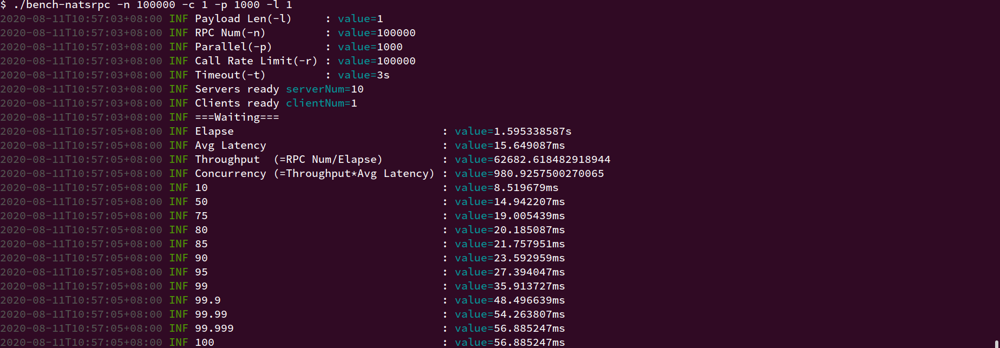
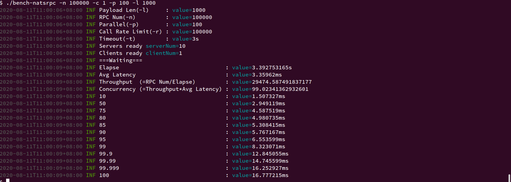
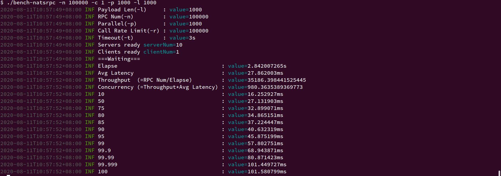

### Bench Natsrpc

This program is used to bench natsrpc's performance under different parameters. See command line options for detail.

Some examples:

#### 100 go routines and payload of 1 byte

#### 1000 go routines and payload of 1 byte

#### 100 go routines and payload of 1000 bytes

#### 1000 go routines and payload of 1000 bytes

