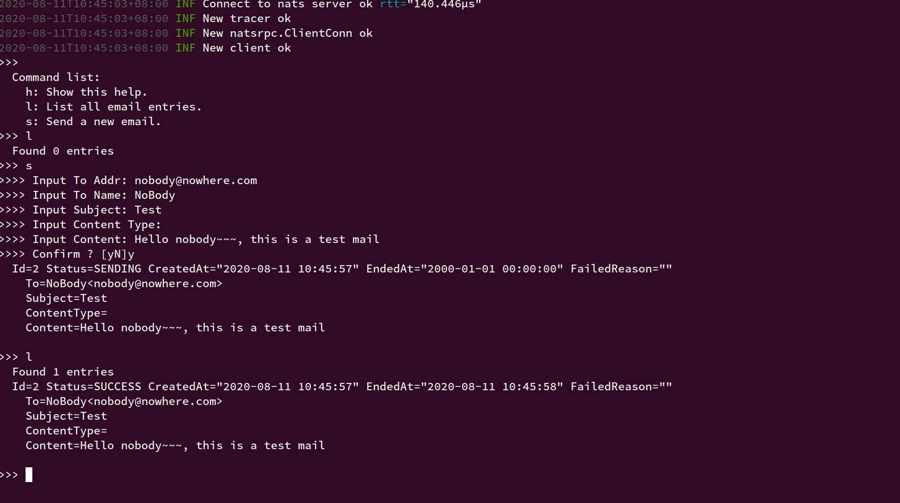
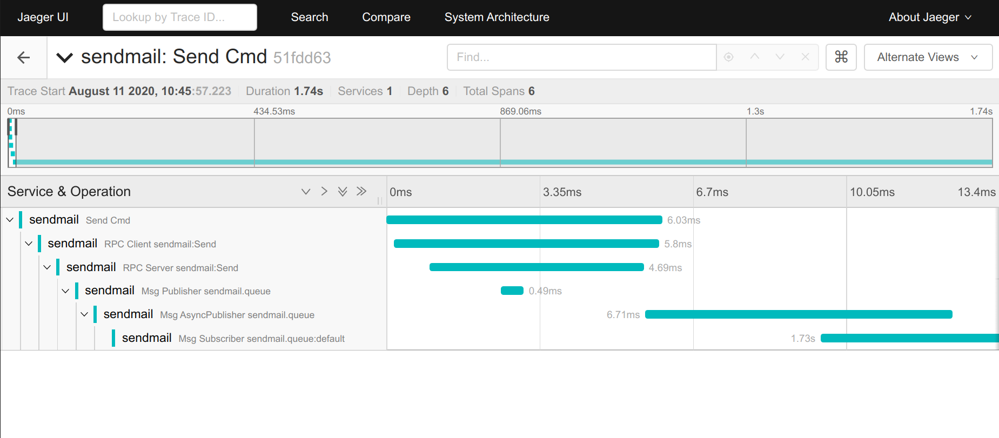

### Sendmail

This example illustrate the usage of: 
  - [natsrpc](https://pkg.go.dev/github.com/huangjunwen/nproto/v2/natsrpc?tab=doc)
  - [stanmsg](https://pkg.go.dev/github.com/huangjunwen/nproto/v2/stanmsg?tab=doc)
  - [binlogmsg](https://pkg.go.dev/github.com/huangjunwen/nproto/v2/binlogmsg?tab=doc)
  - [tracing](https://pkg.go.dev/github.com/huangjunwen/nproto/v2/tracing?tab=doc)
  - [protoc-gen-nproto](https://pkg.go.dev/github.com/huangjunwen/nproto/v2/protoc-gen-nproto?tab=doc)

How to run:
  1. You need to run `../docker-services` first.
  2. `make` to build client/server binary.
  3. Fill `./server/conf.json`. (e.g. smtp/user settings ...)
  3. Run server: `cd server && ./server`
  4. Run client: `cd client && ./client`, then you can issue commands like this:

Example tracing output:

